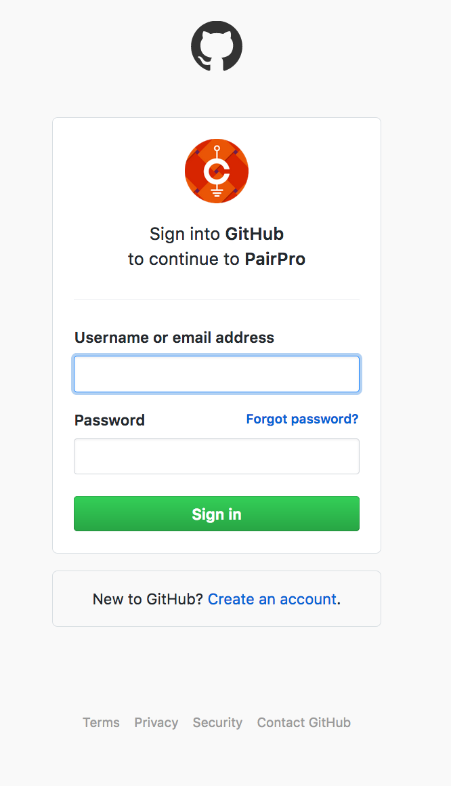
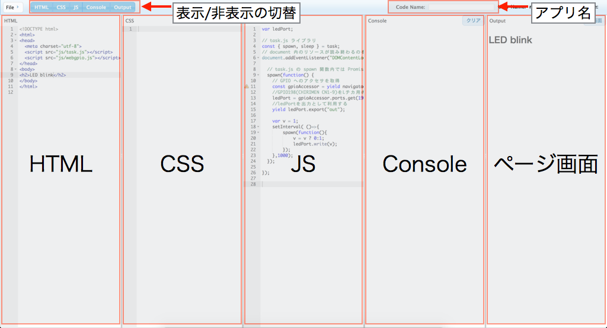
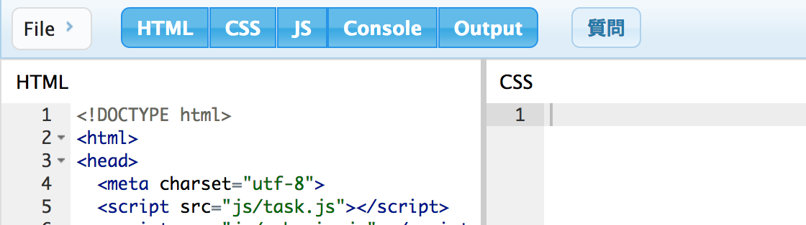
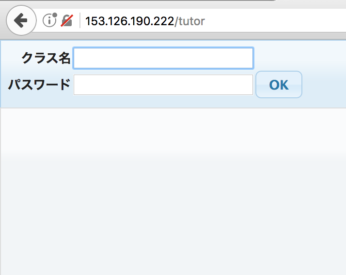
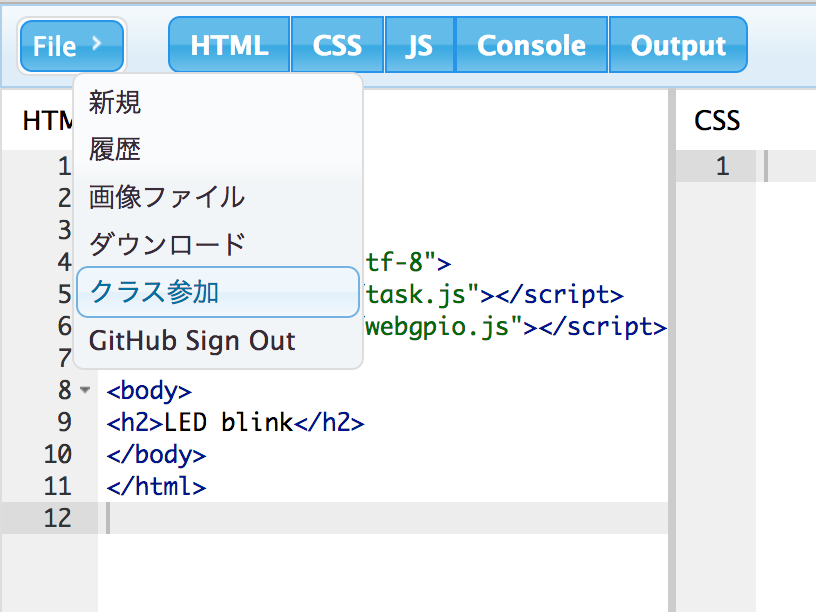
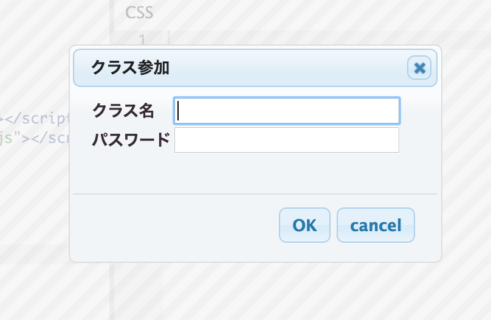
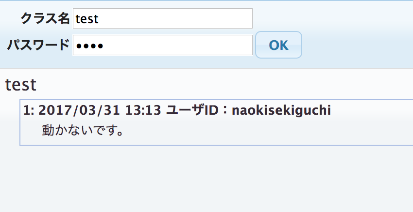
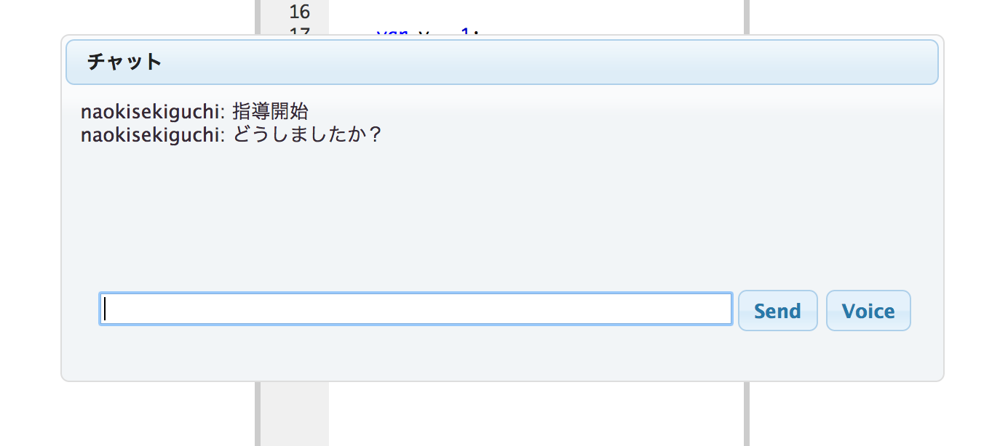

WoTプログラミング環境の使い方

### 1.github認証
WoTプログラミング環境に始めてアクセスすると、githubアカウントによる認証が求められます。お持ちのgithubアカウントを入力してサインインしてください。

### 2.アプリケーションの記述
githubアカウントによる認証が完了すると、アプリケーションの記述画面へと遷移します。HTML,CSS,JSという表示のある欄にそれぞれ記述を行っていくことで、アプリケーションの作成が可能です。ソースコードが変更されるたび、アプリケーションが実行され、Output欄にレンダリング結果が表示されます。一部のログはConsoleログに出力されます。

ソースコードに変更が加えられる度に、その内容をサーバに送信・記録しているため、ブラウザを閉じてしまっても、同じURLにアクセスすることでアプリケーションのロードが可能です。複数人で同じURLにアクセスすることで、変更点を共有しながら共同編集することも可能になります。

HTML,CSS,JS,Console,Outputの各欄は左上のボタンをON/OFFすることで表示/非表示を切り替えることができます。

アプリケーション毎にWoTプログラミング環境のドメイン+ランダム文字列のURLが与えられます。Code Nameという箇所にアプリケーションの名前を記入することができます。

### 3.クラスの作成・参加機能
WoTプログラミング環境ではクラスを作成できます。クラスにはアプリケーションを開発するユーザーと、ユーザーからの質問に答えるチューターが参加します。一人以上のチューターが存在するクラスでは、そのクラスに参加しているユーザーの画面に質問ボタンが表示され、チューターに対して質問できるようになります。

クラスを作成するにはまずチューター画面にアクセスします。チューター画面には、`http://<WoTプログラミング環境のドメイン>/tutor`でアクセスできます。チューター画面で、任意のクラス名、パスワードを入力してOKボタンを押すと、クラスを作成することができます。（同名のクラスが存在している場合は作成できません。）クラスの作成後は、作成時のクラス名、パスワードを入力することでクラスに参加することができるようになります。

ユーザーが作成されたクラスに参加するためには、ユーザー画面左上の`File>クラス参加`から作成済みのクラス名、パスワードを入力してOKボタンを押します。

### 4.チューターへの質問機能
ユーザーの画面で質問ボタンを押すことで、同じクラスに参加しているチューターに質問をすることができます。質問の内容を入力して、OKボタンを押すと、チューター画面に質問リストが追加されます。

チューター画面でリストにある質問をクリックすると、指導が開始されます。質問を行ったユーザーの編集画面へ遷移し、チャット画面が表示されます。チャットでコミュニケーションを取りながら、必要に応じてソースコードを共同編集し、問題を解決していきます。Voiceというボタンを押すとビデオチャットを開始することも可能です。指導完了というボタンを押すことで、指導を終了することができます。

### 5.その他の機能
左上のFileボタンから以下の機能にアクセスすることができます。
* 新規：新規にアプリケーションを作成することができます。新たなURLが与えられます。
* 履歴：過去に作成したアプリケーションにアクセスすることができます。作成日時とURL、アプリケーションの名前が表示されます。
* 画像ファイル：画像ファイルのアップロードが可能です。※ 試験運用サイトにアップロードされた画像は個別のURLに紐付き保管されます。他者に見られる可能性がありますので、秘密情報や個人情報を含む画像はアップロードしないことをお薦めします。
* ダウンロード：作成したアプリケーション一式をダウンロードすることができます。
* GitHub Sign Out：サインアウトすることができます。
